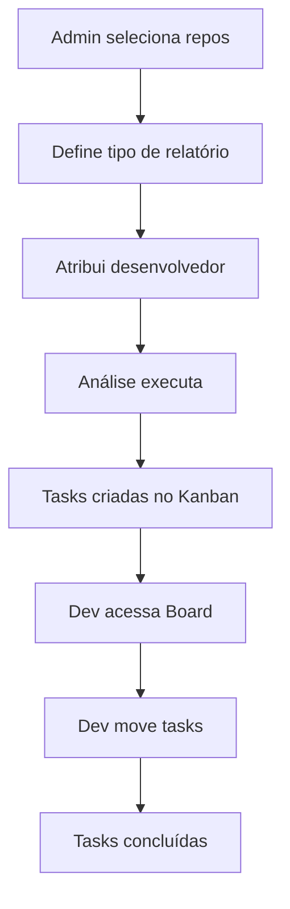

# 🎯 SISTEMA COMPLETO IMPLEMENTADO

## 📋 Resumo das Funcionalidades Implementadas

### 1️⃣ **Admin Cliente - Sistema de Análise Avançado**

#### 📂 Página: `/admin-client/repository-analysis`

**Funcionalidades:**
- ✅ Seleção de repositórios (individual ou todos)
- ✅ Tipo de relatório:
  - **Analítico**: Mostra linha por linha com arquivo, erro e solução da IA
  - **Sintético**: Resumo com estatísticas gerais
- ✅ Atribuição de desenvolvedor ao repositório
- ✅ Criação automática de tasks para o desenvolvedor

**Fluxo:**
1. Admin seleciona repositórios
2. Escolhe tipo de relatório
3. Atribui desenvolvedor (opcional)
4. Clica em "Iniciar Análise"
5. Sistema cria:
   - Análise completa do código
   - Tasks no board Kanban
   - Atribuição do repositório ao desenvolvedor

---

### 2️⃣ **Desenvolvedor - Sistema de Tasks e Board**

#### 📂 Página: `/dev/dashboard`

**Menu "Minhas Atribuições":**
- Lista de repositórios atribuídos ao desenvolvedor
- Estatísticas de findings por repositório
- Status das correções

#### 📂 Página: `/dev/kanban`

**Board Kanban com 3 colunas:**
- 🔵 **A Fazer (To Do)**: Tasks pendentes
- 🟡 **Em Progresso (In Progress)**: Tasks sendo trabalhadas
- 🟢 **Concluído (Done)**: Tasks finalizadas

**Funcionalidades:**
- ✅ Drag & Drop entre colunas
- ✅ Cada card mostra:
  - Título do finding
  - Severidade (Critical, High, Medium, Low)
  - Arquivo e linha do código
  - **Solução sugerida pela IA**
  - Nome do repositório
- ✅ Auto-atualização de status
- ✅ Filtro por desenvolvedor logado

---

### 3️⃣ **Análise de Banco de Dados SQL Server / Oracle**

#### 📂 Página: `/database-scanner`

**Funcionalidades:**
- ✅ Conexão com SQL Server ou Oracle
- ✅ Scan completo de schemas
- ✅ Busca de CNPJs em todas as tabelas
- ✅ Validação de CNPJs encontrados
- ✅ Identificação de CNPJs que precisam migração
- ✅ Relatório detalhado:
  - Schema.Table.Column
  - Valor do CNPJ
  - Row ID para localização
  - Status de validação
  - Necessidade de migração

**Suporte:**
- SQL Server (connection string padrão)
- Oracle (connection string TNS ou Easy Connect)

---

## 🗄️ Estrutura de Banco de Dados

### Novas Tabelas Criadas:

#### `repository_assignments`
```sql
- id: UUID
- client_id: UUID
- repository_url: TEXT
- repository_name: TEXT
- developer_id: UUID (FK users)
- assigned_at: TIMESTAMPTZ
- status: TEXT (active, completed, archived)
```

#### `kanban_tasks`
```sql
- id: UUID
- assignment_id: UUID (FK repository_assignments)
- developer_id: UUID (FK users)
- title: TEXT
- description: TEXT
- status: TEXT (todo, in_progress, done)
- severity: TEXT (critical, high, medium, low)
- file_path: TEXT
- line_number: INTEGER
- finding_type: TEXT
- ai_solution: TEXT
- priority: INTEGER
- started_at: TIMESTAMPTZ
- completed_at: TIMESTAMPTZ
```

#### `database_scans`
```sql
- id: UUID
- user_id: UUID
- database_type: TEXT (sqlserver, oracle)
- connection_string_hash: TEXT
- schemas_scanned: TEXT[]
- findings_count: INTEGER
- status: TEXT (pending, running, completed, failed)
- results: JSONB
```

---

## 🔐 Segurança Implementada

### Row Level Security (RLS):
- ✅ Desenvolvedores veem apenas suas tasks
- ✅ Admins veem todas as tasks do cliente
- ✅ Isolamento por client_id
- ✅ Connection strings nunca são armazenadas (apenas hash)

---

## 📊 APIs Criadas

### Admin Cliente:
- `POST /api/admin-client/analyze-repositories` - Inicia análise de repos
- `POST /api/admin-client/assign-repository` - Atribui desenvolvedor
- `GET /api/repositories` - Lista repositórios com estatísticas

### Desenvolvedor:
- `GET /api/dev/kanban-tasks` - Lista tasks do board
- `PATCH /api/dev/kanban-tasks` - Atualiza status da task
- `GET /api/dev/assignments` - Lista repositórios atribuídos

### Database Scanner:
- `POST /api/database-scan` - Executa scan no banco

---

## 🎨 Componentes Criados

### Admin:
- `components/admin-client/repository-analysis-tab.tsx`
- `components/admin-client/developer-assignment-tab.tsx`

### Dev:
- `app/dev/kanban/page.tsx` (Board Kanban completo)

### Database:
- `app/database-scanner/page.tsx`
- `lib/database/scanner.ts` (Engine de scan)

---

## 🚀 Como Usar

### Para Admin Cliente:

1. **Acesse** `/admin-client/repository-analysis`
2. **Selecione** os repositórios para análise
3. **Escolha** o tipo de relatório (Analítico ou Sintético)
4. **Atribua** um desenvolvedor (opcional)
5. **Clique** em "Iniciar Análise"

### Para Desenvolvedor:

1. **Acesse** `/dev/kanban` para ver suas tasks
2. **Arraste** os cards entre as colunas conforme trabalha
3. **Visualize** a solução sugerida pela IA em cada card
4. **Acompanhe** o progresso de cada repositório

### Para Database Scanner:

1. **Acesse** `/database-scanner`
2. **Selecione** o tipo de banco (SQL Server ou Oracle)
3. **Informe** a connection string
4. **Opcionalmente** especifique schemas
5. **Clique** em "Iniciar Scan"
6. **Visualize** todos os CNPJs encontrados com detalhes

---

## 📦 Dependências Instaladas

```json
{
  "@hello-pangea/dnd": "18.0.1",  // Drag & Drop para Kanban
  "mssql": "12.2.0",              // SQL Server
  "oracledb": "6.10.0"            // Oracle Database
}
```

---

## ✅ Scripts SQL para Executar

Execute na ordem:

1. `scripts/016_repository_assignments_kanban.sql`
2. `scripts/017_database_scans.sql`

---

## 🎯 Fluxo Completo de Uso



---

## 🔧 Próximos Passos Recomendados

1. Testar análise de repositórios reais
2. Validar connection strings de banco de dados
3. Ajustar prioridades e severidades das tasks
4. Implementar notificações quando tasks são atribuídas
5. Adicionar filtros e busca no board Kanban

---

## 📞 Suporte

Para dúvidas ou problemas, consulte:
- `/documentacao/QUESTIONARIO-TECNICO-COMPLETO.md`
- `/documentacao/ANALISE-SISTEMA-CORRECOES.md`
